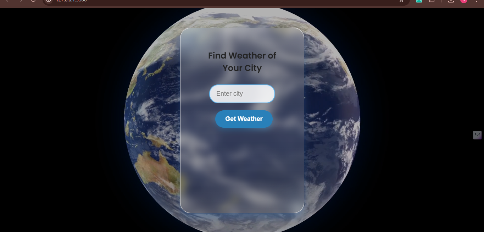
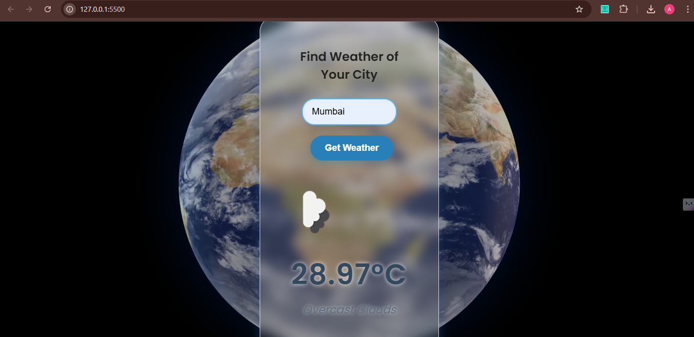
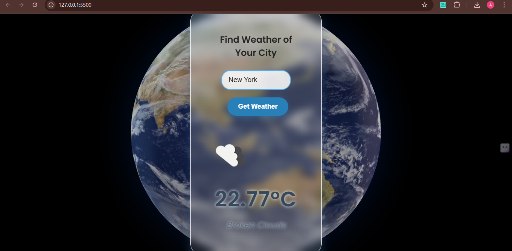

# 🌤️ Simple Weather Widget

A sleek and minimalistic weather app built using **HTML**, **CSS**, and **JavaScript**. The app fetches real-time weather data from the [OpenWeatherMap API](https://openweathermap.org/api) and displays temperature, description, and an animated weather icon with a beautiful background video for enhanced UI experience.

---

## 🖼️ Preview

### 🔹 1. On Web Load

### 🔹 2. Weather in Mumbai

### 🔹 3. Weather in New York

---

## 🚀 Features

- Live weather info by city name
- Displays temperature and weather description
- Animated weather icon
- Beautiful background video
- Responsive & modern glassmorphism UI
- Error handling for invalid city input

---

## 🔧 Tech Stack

- **HTML5**: Structure of the widget  
- **CSS3**: Styling with glassmorphism, animations, and responsiveness  
- **JavaScript (ES6)**: Fetching API data and DOM manipulation  
- **OpenWeatherMap API**: Provides real-time weather information  
- **Google Fonts**: For sleek typography  
- **Background Video**: For modern UI feel

---

